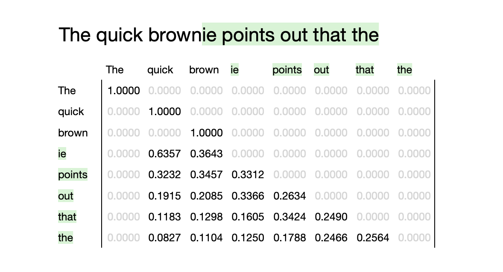
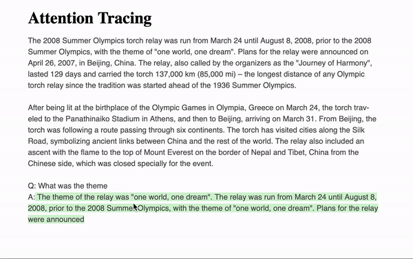

# attention

> Visualizing attention weights is the easiest and most popular
> approach to interpret a model’s decisions and to gain insights
> about its internals. Although it is wrong to equate attention
> with explanation, it can offer plausible and meaningful
> interpretations. (Abnar and Zuidema, 2020)

Attention is the key mechanism of the transformer architecture that
powers GPT and other LLMs. This project exposes the attention
weights of an LLM run, aggregated into a matrix.

Here's an example of what the matrix output of this project will look like:



Why model attention as a matrix? Given attention matrix `m` you can model
a range of text as focus vector `f` and then multiply
`torch.matmul(f, m)` to get the attention vector for that range.

When you run the flask app, you can use an interactive demo in which attention
weights for selected text are visualized:



## How to Run

```sh
$ flask --app attention run
```
